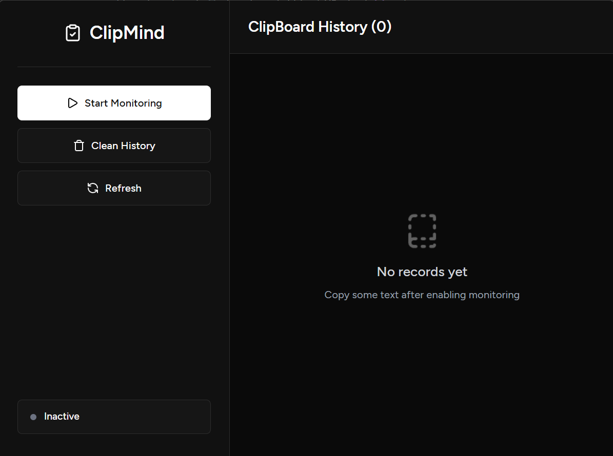
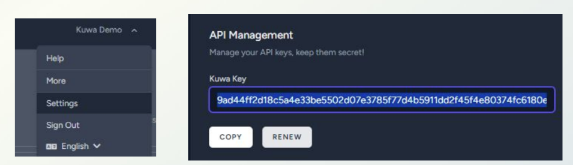

#  🌟 ClipMind - Intelligent Clipboard Manager with Edge AI
The **intelligent clipboard manager** with **edge AI capabilities**, designed to enhance productivity and streamline workflows through **smart content analysis** and **action suggestions**.



Powered by **Turu llama-3b** and **Qualcomm AI Runtime SDK** for efficient on-device AI processing.

## 🏗️ System Architecture
 
### System Flow Diagram
```
[Windows Clipboard Monitoring] → [Content Detection] → [Smart Menu] → [Action Execution] → [Turu llama-3b AI Processing] → [Human Interaction]
↓                                ↓                     ↓              ↓                    ↓                               
(monitor.rs)                     (content_detector.rs) (popup.tsx)    (popup.rs)           (ai_engine.rs)                  
```

### Core Modules

#### 1. **Clipboard Monitoring System** (Rust)
- **File**: `src-tauri/src/clipboard/monitor.rs`
- **Technology**: Windows API + arboard
- **Functionality**: Monitors clipboard changes using Windows API (`WM_CLIPBOARDUPDATE`)
- **Features**: Event-driven architecture, supports real-time detection

#### 2. **Content Analysis System** (Rust + Python AI)
- **Rule Engine**: `content_detector.rs` - Quickly detects well-defined formats
- **AI Extension Point**: `ai_engine.rs` - Utilizes Python AI models for intent analysis
- **Supported Types**: URL, Email, Phone, Code, Address, Financial Information, etc.

#### 3. **Smart Menu System** (React + Tauri)
- **Main Menu**: `popup.tsx` - Popup-based smart menu
- **Styling**: `popup.css` - Modern dark theme design
- **Interaction**: Supports keyboard shortcuts (1/2/3) and mouse operations


## Core Features

### 1. **Human-in-the-Loop Design**
- **User Control**: Users can choose actions from the smart menu, ensuring they remain in control of their data and actions.
- **Privacy**: No automatic actions are taken without user consent, enhancing privacy and security.
- **Transparency**: Clear display of detected content types and available actions.

### 2. **Edge AI**
- **Local Processing**: All AI models run locally on the user's device, ensuring data privacy and reducing latency.
- **Lightweight Models**: Utilizes optimized models (llama-3b) to ensure efficient performance on edge devices.

### 3. **Mulitple stage of AI feedback loop**
- **Content Analysis**: Initial analysis of clipboard content to determine intent and suggest actions.
- **AI Recommendation**: Recommendation of AI-driven tasks such as summarization, translation, and code generation.
- **AI Processing**: Execution of AI tasks locally, with results presented to the user for review and further action.

## 🚀 Get Started

### 🔧 Recommended IDE Setup
Tauri + React + Typescript
- [VS Code](https://code.visualstudio.com/) + [Tauri](https://marketplace.visualstudio.com/items?itemName=tauri-apps.tauri-vscode) + [rust-analyzer](https://marketplace.visualstudio.com/items?itemName=rust-lang.rust-analyzer)


### 📦 Dependencies
- [Node.js](https://nodejs.org/en/) (16+)
- [Rust](https://www.rust-lang.org/tools/install) (1.70+)
- [Tauri CLI](https://tauri.app/v1/guides/getting-started/prerequisites)
- [Python 3.10](https://www.python.org/downloads/)
- [QAIRT SDK](https://qpm.qualcomm.com/#/main/tools/details/Qualcomm_AI_Runtime_SDK) 
- [Kuwa](https://kuwaai.org/blog)

## 🛠️ Environment Setup
```bash
call "C:\Program Files\Microsoft Visual Studio\2022\Community\VC\Auxiliary\Build\vcvarsall.bat" arm64
set PATH=%PATH%;C:\Program Files\LLVM\bin;C:\Program Files\Microsoft Visual Studio\2022\Community\VC\Tools\Llvm\bin;%USERPROFILE%\AppData\Roaming\npm  

set CC=
set CXX=
set AR=
set CC=clang-cl
set CXX=clang-cl
set AR=llvm-ar
```

### AI Model Configuration

You can configure the AI models in `config.yaml`. As long as the model is available on **Kuwa**, you can use it directly. You can also connect to other internal devices to deploy your own AI solution.

```yaml
ai:
  kuwa_url: "http://127.0.0.1/v1.0"
  timeout_ms: 30000
  api_key: "<your_api_key>"
  models:
    default: ".bot/Llama 3.2 3B @NPU"
    translate: ".bot/Llama 3.1 8B @NPU"
    summarize: ".bot/Llama 3.1 8B @NPU"
    explain_code: ".bot/Llama 3.1 8B @NPU"
    optimize_code: ".bot/Llama 3.1 8B @NPU"
```

This section allows you to:

* Set the **default model** for general tasks.
* Assign **different models** for specific functions such as translation, summarization, or code-related tasks.
* Adjust the endpoint, timeout, and API key according to your environment.

## 🛠️ Kuwa Server Setup

Make sure you open the Kuwa server on your desktop (Kuwa GenAI OS).

### Enabling Qualcomm NPU Support in Kuwa v0.4.0

- [NPU setting](https://kuwaai.org/blog/qnn-tutorial)

## 🛠️ Run — Development
```bash
cd /d C:\Users\HackathonUser\ClipMind\src-tauri
cargo clean
pnpm tauri dev
```

## 🛠️ Or Build — Produce Windows .exe
### Steps

### 1. Config API

1.1 Download and run Kuwa GenAI OS

1.2 Obtain API key


1.3 Save the API key to the ./src-tauri/.env file:
```
KUWA_API_KEY=your_api_key_here
```

### 2. Install dependencies (choose one):
```bash
cd ClipMind

# using npm
npm install
# or using pnpm
pnpm install
```

### 3. Build the frontend:
```bash
cd ClipMind/src

# Example - run the frontend build (use the package manager you use)
npm run build   # or pnpm build / yarn build
```

### 4. Back to the project root and run Tauri build to produce the Windows binary:

```bash
cd ClipMind

# Common commands
npm run tauri build
# or
pnpm tauri build
```

### 5. After the build finishes, the output is located at:
```
src-tauri/target/release/bundle/nsis/.
```

### 6.Now you can double-click ClipMind.exe to run it (make sure Kuwa GenAI OS is running before you click)


## Installation

### 🛠️ QAIRT Installation
Typically we recommend using the same QAIRT SDK version that AI Hub uses to compile the assets. You can find this version by clicking the job links posted printed by the export command.

Go to [QAIRT SDK](https://qpm.qualcomm.com/#/main/tools/details/Qualcomm_AI_Runtime_SDK) and follow the installation instructions. Note that the first time after log in you would be redirected to QPM home page. Click on the link again to get to the QAIRT download page.

If successful, you should see a message with the install path. This will depend on the platform and can look like this:

```
C:\Qualcomm\AIStack\QAIRT\<version>
```
On Windows, you can search the taskbar for "Edit the system environment variables".

### 🛠️ Kuwa GenAI OS Installation
- Please follow [Kuwa installation guide](https://github.com/kuwaai/kuwa-aios/tree/main?tab=readme-ov-file#installation-guide) to install Kuwa.
